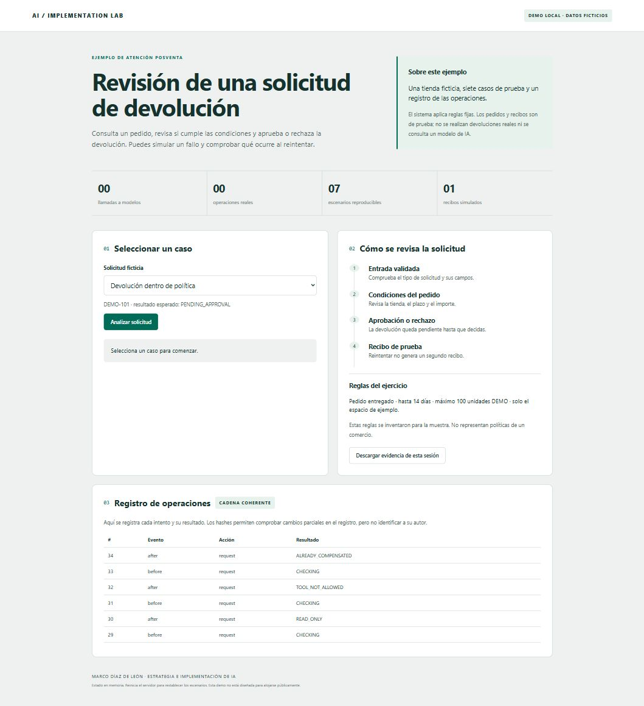

# AI Implementation Lab

**Marco Díaz de León · Forward Deployment / AI Implementation Strategy**

I help teams define what they need, decide which systems to connect and organize the implementation. This repository shows the requirements, technical decisions and tests for a small working example.

The example uses fictional orders and a simulated refund process. Code was developed with AI assistance. My role is to define the problem, choose the scope and coordinate delivery.

[Guía en español](docs/START_HERE_ES.md) · [Engineering guide](docs/engineering-guide.md) · [Evidence](evidence/latest.json) · [What is and is not implemented](docs/capabilities.md)

## Reviewing a refund request

The working example is a fictional after-sales assistant. It reads a synthetic order, checks an exercise policy, proposes a refund, waits for a reviewer decision and creates a **local simulated receipt**.

Try executing a refund before approval, then approve it and simulate a connector failure. The event log shows each attempt. A successful retry produces one local receipt.



### Where to start

| Visitor | Read first | Then inspect |
|---|---|---|
| Recruiter: how does Marco work? | [Profile and working method](docs/engineering-guide.md) | [Decision record](docs/decisions.md) |
| Client: how would an idea become an implementation? | [Problem, scope and acceptance](specs/001-support-demo/spec.md) | [Demo walkthrough](docs/demo-script.md) |
| Technical reviewer: does the sample work? | Run the commands below | [Tests](tests/), [MVC and MCP](docs/architecture.md), [evidence](evidence/latest.json) |

## Run the demo

Requirements: **Python 3.11+ and Git**. No third-party Python packages, API keys, model subscriptions or installation of connectors.

```sh
git clone https://github.com/marcodiazleon/ai-implementation-lab.git
cd ai-implementation-lab
python scripts/verify.py
python run.py serve
```

Open **http://127.0.0.1:8765**. Stop with Ctrl+C. On systems where Python is named `python3` or `py`, use that launcher instead. Another port: `python run.py serve --port 8766`.

Try the eligible case, attempt execution before approval, approve it, simulate a connector failure, and retry. [Exact steps and expected results](docs/demo-script.md).

Other entry points:

```sh
python run.py evaluate
python run.py demo
python run.py mcp
```

`demo` scripts the reviewer decision for an automated example. The browser walkthrough is the human interaction. `mcp` waits for JSON-RPC on stdin; it is not an interactive chat prompt.

## What is in the sample?

- **Working application:** local web UI, domain rules, review state machine, simulated connector and retry protection.
- **Project records:** requirements, test references, decisions and results. The initial SDD process is incomplete; see the [method review](docs/sdd-adoption.md).
- **Hooks:** application lifecycle events and an optional Git pre-commit guard that inspects staged bytes.
- **Data skill:** documented procedure plus an executable validator.
- **MCP:** a limited, version-pinned stdio adapter exposing two read-only tools.
- **Seven scenarios:** eligible request, expired window, excessive amount, foreign workspace, read-only lookup, unknown order and disallowed tool.
- **Visible boundaries:** source-level tests, synthetic scenario evaluation and limitations are separate from production acceptance.

## Inspect the structure

```text
src/lab/       models, controller, application hooks, HTTP and MCP adapters
web/           browser view: HTML, CSS and JavaScript
data/          synthetic orders, exercise policy and scenarios
tests/         workflow, concurrency, HTTP, MCP and publication-guard tests
scripts/       validation, publication checks and evidence generation
.agents/skills/ small reusable procedures with concrete outputs
.githooks/     optional local pre-commit guard
specs/         requirements, implementation plan and acceptance matrix
docs/          working method, trade-offs, walkthrough and expansion ideas
evidence/      machine-readable results tied to source hashes
reports/       human-readable interpretation of those results
```

[Why each folder exists](docs/engineering-guide.md#how-i-organize-the-work).

## Current limits

This is a deterministic integration demonstration, **not a deployed autonomous AI service**. There are no LLM calls, real customers, real refunds or external business connections. The reviewer role is simulated; any local caller can use the decision endpoint. State disappears on restart. Retry protection applies within one process, not to distributed transactions.

The hash chain detects ordinary edits if hashes are left unchanged; it is not a signed, immutable audit log. The disallowed-tool case tests an allowlist, not resistance to arbitrary prompt injection. The MCP adapter is wire-tested for its documented subset, not certified or tested with a live assistant client.

[Security boundaries](SECURITY.md) · [Ten expansion ideas and current status](docs/roadmap.md) · [Contributing](CONTRIBUTING.md)

## Reuse and contact

This repository is public for inspection. No open-source license has been granted in this version; visibility is not a license to redistribute or incorporate it into a commercial product. Contact Marco through [his GitHub profile](https://github.com/marcodiazleon) to discuss an implementation or reuse.
