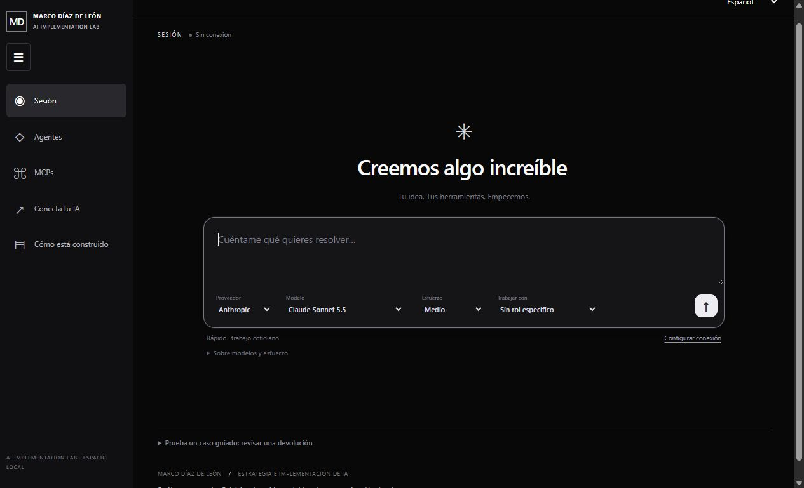

# AI Implementation Lab

**Marco Díaz de León · Forward Deployment / AI Implementation Strategy**

[](https://github.com/marcodiazleon/ai-implementation-lab/actions/workflows/pages.yml)

**[Open the live demo](https://marcodiazleon.github.io/ai-implementation-lab/)**. It runs in your browser with fictional data. No account, key or personal data is needed.

[Español abajo](#en-español)



## What this is

A small, working example of how I take an AI idea from requirement to tested implementation. The example is a fictional after-sales assistant. It reads an order, checks a refund policy, proposes a refund and waits for a person to approve it before creating a **simulated** receipt.

I defined the problem, the scope and the acceptance criteria. The code was written with AI assistance and checked against those criteria.

## What it demonstrates

- **Human approval before any effect.** Execution is blocked until a reviewer approves, and stale proposals are rejected.
- **Safe retries.** A connector failure keeps the approval, and twenty concurrent retries still produce one receipt.
- **Traceability.** Every requirement links to acceptance cases, tests and evidence. The demo's Evidence view shows this live.
- **Bounded AI connections.** The local version can call OpenAI or Anthropic with your own key, after explicit consent, as text-only assistants with no tools.
- **Automated checks.** Every push runs the full verification on Linux and Windows, and the public demo is published only when it passes.

## Run it locally

Requires Python 3.11+ and Git. No third-party packages.

```sh
git clone https://github.com/marcodiazleon/ai-implementation-lab.git
cd ai-implementation-lab
python scripts/verify.py
python run.py serve
```

Open http://127.0.0.1:8765. The verification run rewrites the evidence files with your results. The [demo walkthrough](docs/demo-script.md) lists the exact steps.

## Limits

- This is a deterministic demonstration, not a deployed autonomous service. There are no real customers, refunds or business systems.
- The reviewer role is simulated. Any local caller can approve.
- State lives in memory and resets on restart.
- Calls to OpenAI and Anthropic were tested with local doubles only. A live call is not yet recorded.

Full list: [what is and is not implemented](docs/capabilities.md) · [security boundaries](SECURITY.md).

## Go deeper

| If you want to see | Read |
|---|---|
| How I work | [Engineering method](docs/engineering-guide.md) |
| Requirements and acceptance | [Specification](specs/001-support-demo/spec.md) · [case results](specs/001-support-demo/acceptance.csv) |
| Design and architecture | [Architecture](docs/architecture.md) · [decisions](docs/decisions.md) |
| Agents, MCP and AI connections | [Workbench guide](docs/WORKBENCH.md) · [AI connection guide](docs/OPENAI_API.md) |
| Test evidence | [Latest run](evidence/latest.json) |
| What comes next | [Roadmap](docs/roadmap.md) |

## Reuse and contact

This repository is public for inspection. No open-source license is granted. To discuss an implementation or reuse, contact Marco through [his GitHub profile](https://github.com/marcodiazleon).

---

## En español

Ejemplo pequeño y funcional de cómo llevo una idea de IA desde el requisito hasta una implementación probada. **[Abre la demo](https://marcodiazleon.github.io/ai-implementation-lab/)**: corre en tu navegador con datos ficticios, sin cuenta, clave ni datos personales.

Un asistente de posventa ficticio lee un pedido, revisa una política de devolución y propone un reembolso. Una persona debe aprobarlo antes de generar un recibo **simulado**. Yo definí el problema, el alcance y los criterios de aceptación. El código se escribió con asistencia de IA y se verificó contra esos criterios.

Cada push ejecuta la verificación completa en Linux y Windows, y la demo pública solo se publica si pasa. Las conexiones a OpenAI y Anthropic se probaron con dobles locales, y aún no hay una llamada real registrada.

Para ejecutarlo localmente, usa los mismos comandos de arriba. La [guía en español](docs/START_HERE_ES.md) explica el recorrido completo.
