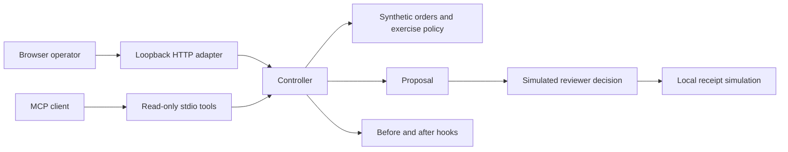

# Architecture and contracts

## MVC is not MCP
MVC organizes application responsibilities. MCP defines a client-to-tool protocol. This sample uses both for different purposes.

| Responsibility | Implementation |
|---|---|
| Model | `models.py`, synthetic fixtures and proposal state |
| Controller | `controller.py`: eligibility, decisions, scope and retry rules |
| View | `web/`: selection, reviewer controls and event trace |
| HTTP adapter | `server.py`: explicit routes on loopback |
| MCP adapter | `mcp_server.py`: two read-only tools over stdio |
| Hooks | `hooks.py`: before/after application events |

The MCP client has no approve or execute tool. HTTP review buttons exercise a workflow gate; they do not authenticate a person. The local operator has full demo authority.

## State and failures
A proposal starts PENDING_APPROVAL and can become APPROVED or REJECTED. Execution requires approval and unchanged order/policy digests. A successful simulation becomes SIMULATED. A retry returns the same stored receipt. A changed proposal cannot create a second receipt for an already compensated order in that process.

A simulated connector failure occurs **before** writing a receipt. This demonstrates safe retry for a known pre-effect failure. It does not solve an external provider timing out after a real effect, crash recovery, database atomicity or distributed concurrency.

An RLock serializes controller operations in one process. Memory is cleared by restart. After-hook failures following a state change are not transactionally rolled back; production would need a transactional outbox or equivalent durable design.

## MCP subset
Protocol version: **2025-11-25**, deliberately pinned, not a claim of latest-version support.
Transport: newline-delimited JSON-RPC over stdin/stdout.
Methods: initialize, notifications/initialized, ping, tools/list, tools/call.
Tools: lookup_demo_order(order_id), read_demo_policy().
Not included: HTTP transport, authentication, subscriptions, pagination, resources, prompts, cancellation, live client configuration or certification.

Run `python run.py mcp` from the repository. A client would launch that command with the repository as working directory. No connector is installed or connected automatically.

## U07 workbench

The browser coordinates four role contracts. `src/lab/agents.py` owns input, permission, output and evidence hooks. `CloudSessions.task` makes a single isolated model request without touching chat history. `src/lab/context7.py` owns the fixed remote MCP transport and expiring sessions. The view selects when documentation is included; returned text cannot invoke tools. [Details](WORKBENCH.md).

## U08 workspace
`studio.js` owns routing, the sidebar, agent forms and public MCP configuration export. `cloud.js` handles provider sessions and chat. `AgentStore` persists validated definitions at a fixed local path. The server resolves agent IDs into instructions; clients cannot select files or grant tools. Each cloud session owns a fixed transport for OpenAI or Anthropic. Changing agent or prompt revision isolates conversation context. The refund domain and its simulated connector remain independent.

## U09 model settings
`model_catalog.py` supplies a reference catalog at GET `/api/model-catalog`. POST `/api/cloud/configure` accepts only session ID, model and effort, locks the existing provider session during access checks and commits on success. It cannot change provider, reset counters or widen tools. Unsupported effort is rejected before network access. Animated invitation text is decorative; a stable accessible name labels the composer.
