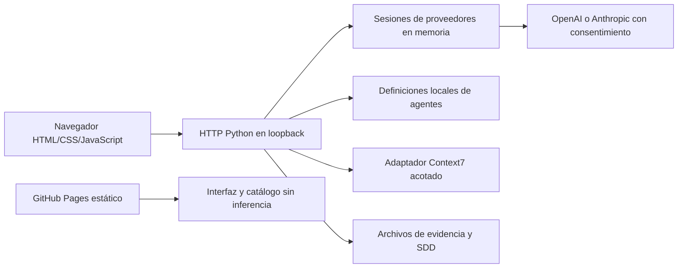

# AI Implementation Lab — Technical Requirements Document

Versión documental 0.2 · 2026-10-05 · Base de código: `95c1795dc363c6013653e9d0053e377a3d14d6a2` · Revisión interna; aceptación de Marco pendiente.

## 1. Arquitectura y responsabilidades

El navegador presenta texto y configuraciones. El servidor valida entradas, destinos y sesiones. Los agentes producen propuestas textuales: no tienen herramientas de archivos o shell. El controlador de devoluciones sigue siendo código histórico y CLI; U12 lo retiró de la interfaz.

## 2. Tecnología y reproducción

Python 3.11+ y biblioteca estándar; HTML, CSS y JavaScript sin framework ni fuentes externas. Git permite descargar una copia de evaluación; Node ejecuta la comparación Python/JavaScript y comprobaciones de sintaxis. No se requieren paquetes Python externos. Las versiones efectivamente ejecutadas constan en `evidence/latest.json`; el requisito mínimo no acredita funcionamiento en otro equipo.

`python scripts/check_environment.py`, `python scripts/verify.py` y `python run.py serve` son los comandos de evaluación. `python scripts/build_pages.py` produce `_site/`. El servidor es de desarrollo: no se publica en Internet.

## 3. Requisitos técnicos trazables

| Requisito canónico | Implementación | Comprobación |
|---|---|---|
| R08 | `src/lab/server.py`: bind 127.0.0.1, Host/Origin y JSON | `tests/test_http.py`, `tests/test_cloud.py` |
| R16,R24 | `cloud.py`: destinos fijos, consentimiento, errores saneados, sesiones aisladas | `test_cloud.py`, `test_studio.py` |
| R22 | `agent_store.py`: esquema cerrado y reemplazo atómico | `test_studio.py` |
| R20,R23 | `context7.py` y guía MCP en `web/studio.js` | `test_context7.py`, `test_workbench_http.py` |
| R25,R26 | catálogo y parámetros compatibles; cambios transaccionales | `test_session_controls.py` |
| R27 | tres rutas fijas de evidencia; datos estáticos equivalentes | `test_evidence_http.py`, `test_pages.py` |
| R30 | cinco destinos, diálogo, catálogo público, credenciales bloqueadas | `test_session_shell.py`, C139–C143 |
| R11,R12,R14 | documentos, continuidad y revisión por versión | SDD, C144–C146 y T46 |

## 4. Integraciones y límites

OpenAI y Anthropic usan adaptadores HTTPS de host fijo. El operador introduce su clave y acepta la transmisión; no hay descubrimiento de claves del entorno, fallback de proveedor ni inferencia compartida. El catálogo es una referencia versionada, no una lista de permisos de la cuenta. La configuración de modelo puede comprobar acceso remoto; la inferencia real requiere un envío explícito.

Context7 ofrece un adaptador de dos herramientas de lectura. Los perfiles HTTP/stdio de la guía son JSON para otro cliente; no arrancan procesos ni habilitan servidores arbitrarios en esta aplicación. Las pruebas de proveedores usan transportes simulados. La disponibilidad real de cada modelo no se acredita con esos dobles.

## 5. Datos, seguridad y fallos

Sesiones: memoria de proceso, máximo ocho, caducidad por inactividad de 1800 segundos evaluada al acceder y límite de veinte peticiones. No es eliminación criptográfica inmediata ni aislamiento multiusuario. El historial se acota; reiniciar pierde sesiones. Cambiar modelo limpia historial; cambiar esfuerzo lo conserva; desconectar retira la sesión.

Agentes: `.local/agents.json`, ignorado por Git. La interfaz conserva también preferencias y perfiles MCP en almacenamiento del navegador. Los límites precisos y contratos están en [Backend Schema](05_BACKEND_SCHEMA.md).

Host/Origin restringen peticiones del navegador; otro proceso local puede acceder al servidor. No se declara autenticación de producción, cifrado de disco, base SQL, alta disponibilidad o transacción duradera. Los fallos se informan con códigos; no se reintenta automáticamente una petición de inferencia.

## 6. Verificación y entrega

101 pruebas y siete escenarios pasaron localmente sobre esta base; ver evidencia por caso. SDD valida estructura, no verdad semántica ni aceptación humana. Navegador, proveedor real, otro equipo, revisión independiente y despliegue tienen estados propios. El PR #5 en 95c1795 completó CI Ubuntu/Windows en run 37372497568; el nuevo incremento requiere checks propios.

Fuentes: [SDD](../../specs/001-support-demo/spec.md), [plan](../../specs/001-support-demo/plan.md), `src/lab/server.py`, `cloud.py`, `agent_store.py`, `context7.py`, `scripts/build_pages.py`. [PRD](01_PRODUCT_REQUIREMENTS_DOCUMENT.md) · [Plan de implementación](06_IMPLEMENTATION_PLAN.md).
