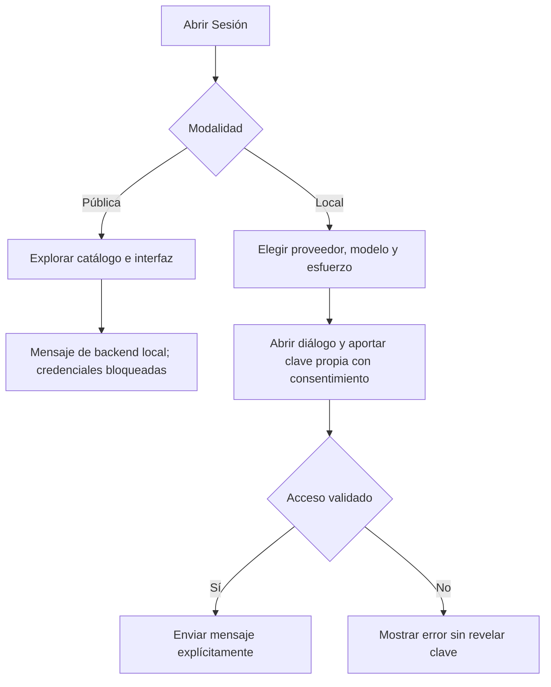

# AI Implementation Lab — App Flow

Versión documental 0.2 · 2026-10-05 · Base `95c1795` · Recorrido derivado del código y checks Chromium estáticos/locales; véase reports/CONTINUATION_REVIEW_2026-10-05.md.

## 1. Mapa de navegación

| Destino | Hash | Propósito |
|---|---|---|
| Sesión | `#demo`; alias `#session` y `#chat` | Mensaje, proveedor, modelo, esfuerzo y agente |
| Agentes | `#agents` | Crear, editar, guardar y exportar definiciones |
| MCPs | `#mcp` | Preparar perfiles; acceso separado a Context7 |
| Cómo está construido | `#method` | Componentes, decisiones y método |
| Evidencia | `#evidence` | Resumen de ejecución y requisitos/casos |

`#connection` abre el diálogo dentro de Sesión. Un hash desconocido vuelve a Sesión. El menú se contrae y presenta un fondo de cierre en pantalla estrecha. ES/EN cambia la interfaz; no traduce mensajes del usuario o del modelo.

## 2. Abrir y preparar

Abrir la página no ejecuta inferencia. La vista pública permite inspección y definiciones en la pestaña; no tiene servidor de conversación. La evaluación local se inicia con Python en loopback.

## 3. Conversar

Elegir agente textual o ninguno → escribir → conectar con consentimiento cuando falta conexión → enviar → ver respuesta o código de fallo. El diálogo conserva el borrador. El servidor valida proveedor/modelo/esfuerzo; un cambio de proveedor requiere otra conexión. Cambiar modelo limpia el historial; cambiar esfuerzo lo conserva. Cambiar contexto de agente separa historial. Limpiar historia y desconectar son acciones diferentes.

Una petición en curso bloquea operaciones incompatibles; límites y caducidad producen mensajes explícitos. No se atribuyen herramientas, pruebas ejecutadas o modificación de archivos a una respuesta textual.

## 4. Agentes y MCPs

Agentes: seleccionar plantilla o iniciar vacío → completar nombre, rol, instrucciones y modo → guardar → elegir en Sesión o exportar JSON. Localmente se conserva en `.local/agents.json`; públicamente en memoria de pestaña. El export incluye capacidades textuales, no permisos ejecutables.

MCPs: elegir HTTP/stdio → completar perfil → validar → preparar/guardar en navegador → exportar configuración. Ninguno de esos pasos conecta o ejecuta el comando. Context7 tiene un recorrido separado de consentimiento, conexión y lectura limitada; el modo público no provee ese backend.

## 5. Evidencia y estados excepcionales

Evidencia carga ejecución, requisitos y acceptance.csv. Seleccionar requisito muestra casos, estado y enlace de evidencia. Un PASS exige caso con evidencia; PENDIENTE no se convierte en aceptación del propietario. Comprobar siempre versión de origen: un resultado antiguo puede describir comportamiento retirado de la interfaz.

| Situación | Resultado requerido |
|---|---|
| Sin backend público | Explicación de evaluación local y bloqueo de credenciales |
| Clave/acceso rechazados | Código saneado; sin clave en salida |
| Esfuerzo incompatible | Rechazo; sin configuración parcial |
| Sesión expirada/límite | Mensaje explícito; reconexión decidida por operador |
| Definición inválida | No guardar; indicar revisión de campos |
| Evidencia no disponible | Estado de error; no PASS predeterminado |

## 6. Aceptación pendiente y fuentes

C142 cubre navegación, proveedores, diálogo, idioma, borrador y teclado/móvil; C143 requiere clave y consentimiento del operador. La captura de referencia de Marco no está disponible en este adjunto. No se declara comparación visual completada.

Fuentes: `web/studio.js`, `web/cloud.js`, `web/i18n.js`, `web/evidence.js`, `web/public-demo.js`, `src/lab/cloud.py`. [SDD](../../specs/001-support-demo/spec.md) · [Design Brief](04_DESIGN_BRIEF.md) · [PRD](01_PRODUCT_REQUIREMENTS_DOCUMENT.md).
